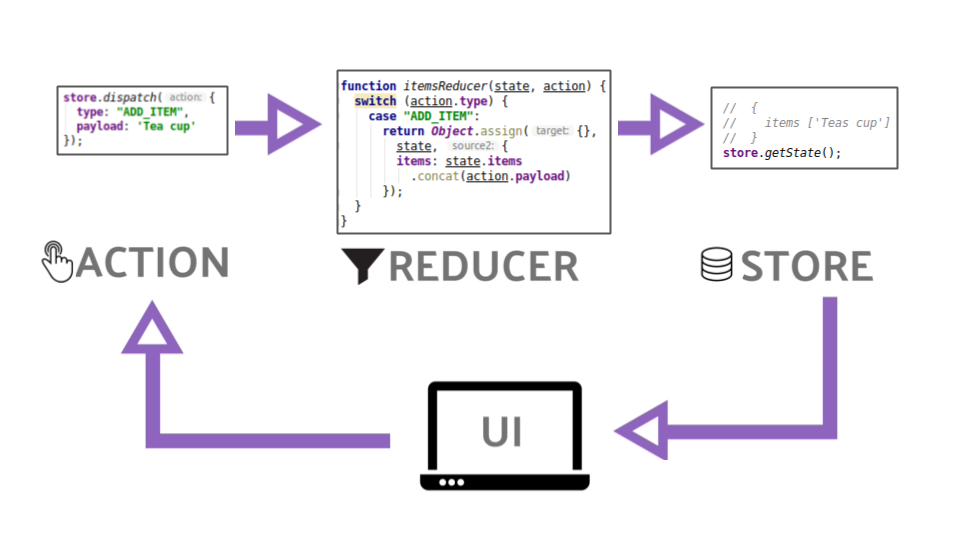

## Module 4
### State Management
(Optimized for presentation using [reveal-md](https://github.com/webpro/reveal-md))

### Goals
* Understand the motivation for using Application State Management
* Understand the guidelines State Management 
* Practice State Management with MobX

---

### Agenda
1. What is an Application State?
2. State Management motivation and limits
3. Libraries and Tools
4. Design Patterns
5. Guidelines

---

### What is a Application State?
Discussion: How would you define an Application State?


* The outcome of all of the events occur in the app (whatever the source)
* A snapshot of the application in a specific moment of time
* All the required data which represent the application in a specific moment
* An object which contain All the required data to recover application snapshot
* Single source of truth for the application UI


---

### State Management motivation and limits
Discussion: 
1. Why should we manage Application State?

* As application grows so their complexity, without a good pattern code will become hard to maintain
<Spagetti image>


* Multiple Components may use the same data

* Multiple Components affect the same data (and each other)

* Make it easy for saving application state for later load (think of local storage)

---

### State Management motivation and limits
Discussion: 
1. ~~Why should we manage Application State?~~
2. Why using state management solutions (mobx, redux) instead of doing it ourselves?

* It's battle tested, used on [many applications and use cases](https://github.com/mobxjs/awesome-mobx#examples)

* Community [Information, Documentation and Support](https://mobx.js.org/README.html)

* [Ecosystem](https://github.com/mobxjs/mobx-utils)

* No need to reinvent the wheel
        <image>
    

---

### Libraries and Tools
Redux

* store - manage your stuff
* state - object represent app in a specific time
* action - plain object represent an event
* reducer - transform old state + action to a new state

---

### Libraries and Tools
Redux



---

### Libraries and Tools
MobX


---

### Libraries and Tools
MobX

* [Introduction](https://mobx.js.org/getting-started)
* [Concepts](https://mobx.js.org/intro/concepts.html#concepts)
    - State : State is the data that drives your application
    - Derivations : Computed values and Reactions
    - Actions: any piece of code that changes the state
    
    
---

### Libraries and Tools - MobX
```jsx harmony
class ObservableTodoStore {
	@observable todos = [];

    constructor() {
        // Reaction
        mobx.autorun(() => console.log(this.report));
    }

	@computed get completedTodosCount() {
    	return this.todos.filter(
			todo => todo.completed === true
		).length;
    }
    
	@computed get report() {
		// ...
	}
    
    @action
	addTodo(task) {
		this.todos.push({
			task: task,
			completed: false,
			assignee: null
		});
	}
}

```

---

### Libraries and Tools - MobX
keep in mind: decorators are simply 
[sugar coating for a wrapper function](https://www.sitepoint.com/javascript-decorators-what-they-are/) 
Practice: simple todo app with mobX
https://mobx.js.org/best/decorators.html

---

### Libraries and Tools - MobX
MobX & React
* MobX is Framework agnostic. However, tools for easy integration with react are available
* Presenting: React Context
* Integrating MobX With React


---

### Libraries and Tools - MobX

* hooks? - mobx react lite / mobx-react6 - if not you'll get an error
* dev tools?


---

### Design Patterns
> People often use MobX as alternative for Redux. But please note that MobX is 
> just a library to solve a technical problem and 
> not an architecture or even state container in itself. 

Live Demo (Okat Cupid Repo)


* Providing Store
* window.store in dev

---

### Design Patterns
Practice MobX (Okat Cupid Repo)
MobX + Mobx-react-lite already installed
Context with provider exist

1. Move App state to Mobx
2. Make App Reactive to state
3. Add favorite feature
    - User can mark favorite profiles
    - User can click favorite button on app bar to toggle favorite mode
    - On favorite mode, only favorite profiles will be displayed
    - Text filter should work correctly on both modes
    - Bonus: show favorite counter on app bar
4. Save state to local storage on each change. On page reload, state should be recovered from local storage.


---

* Introduction to MobX State Tree?
https://www.youtube.com/watch?v=pPgOrecfcg4
https://www.youtube.com/watch?v=uBymH1JbKHs&list=PLucG_ap4Oxzj5TKvdOKc7W10NLMMg319A
https://github.com/mobxjs/awesome-mobx


---

### Guidelines
* Uni-directional data flow (Action => State => View)
* State is pure logic structure (Think about dispatching actions from Console)
* Single source of truth - Preferably, The state of your whole application is stored in an object tree within a single store
    - Mobx is un-opinionated and allow you to use separate stores
* State is read-only - To change the state is emit an action, which will be treated by the state management system.
* [Data / UI separation](https://mobx.js.org/best/store.html#domain-stores)
* Function Purity (In Redux - the reducers, In MobX - Computed values)

* Think about serialization
    - Option 1 : keep data in plain Objects (In Typescript use interfaces instead of classes)
    - Option 2 : design serialization strategy (you own solution or [exist one](https://github.com/typestack/class-transformer))

https://reactjs.org/docs/context.html
https://mobx-react.netlify.com/recipes-migration

https://mobx-react.netlify.com/observer-hook
One good thing about this is that if any hook changes an observable for some reason then the component won't rerender twice unnecessarily. (example pending)
// check keotic-ui broadcast case.


---

### Wrap Up


---

### Further reading
* [Becoming fully reactive: an in-depth explanation of MobX](https://medium.com/hackernoon/becoming-fully-reactive-an-in-depth-explanation-of-mobservable-55995262a254)

---

### Home Work:

