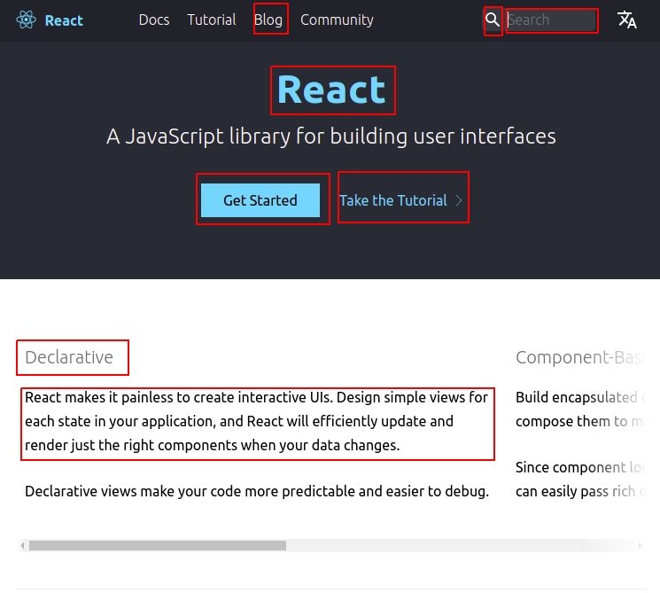
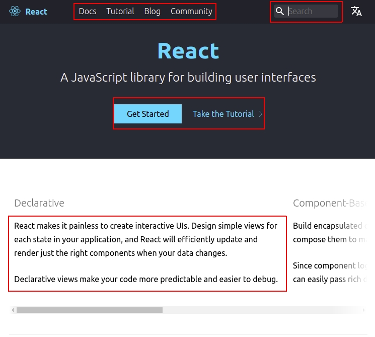
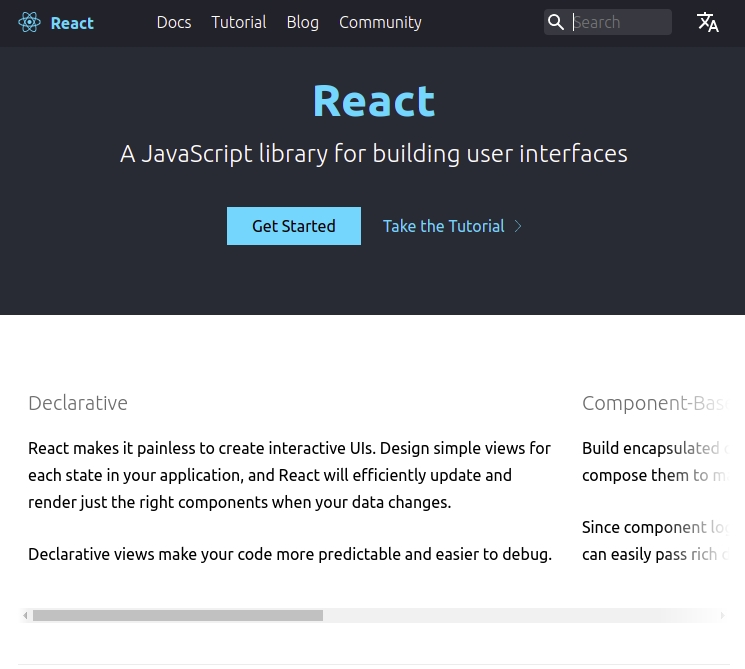

## Module 5
### Atomic Design Methodology
(Optimized for presentation using [reveal-md](https://github.com/webpro/reveal-md))

### Goals
Understand the benefits of Atomic Design and Storybook

---

### Agenda
1. Atomic Design Introduction
2. Storybook

---
### [Atomic Design](https://bradfrost.com/blog/post/atomic-web-design/) Introduction
[Atomic Design](http://atomicdesign.bradfrost.com/) is a methodology 
that involves breaking a website layout down into its basic components, 
which are then reused throughout the site

---

### [Atomic Design](https://bradfrost.com/blog/post/atomic-web-design/) Introduction
> Atomic design is methodology for creating design systems. 
> There are five distinct levels in atomic design:
> * Atoms
> * Molecules
> * Organisms
> * Templates
> * Pages

---

### [Atomic Design](https://bradfrost.com/blog/post/atomic-web-design/) Introduction

> Atoms - The most basic building block of a web page. 

Atoms arn not dividable.

Examples: Buttons, TextBox, links, slider etc.



---

### [Atomic Design](https://bradfrost.com/blog/post/atomic-web-design/) Introduction

> Molecules - Relatively simple groups of UI elements functioning together as a unit.

Everything bigger than an Atom should be at least - a Molecule 

Examples: Search box (TextBox with button or icon), set of buttons or text elements.



---

### [Atomic Design](https://bradfrost.com/blog/post/atomic-web-design/) Introduction

> Organisms are relatively complex UI components composed of groups of molecules and/or atoms and/or other organisms


Distinct sections of an interface

Examples: Header, Footer, Grid, Carousel


---

### [Atomic Design](https://bradfrost.com/blog/post/atomic-web-design/) Introduction

> Templates are page-level objects that place 
> components into a layout and articulate the design’s underlying content structure

Templates are generic page structure (like page with place holder for Components / Content)


---

### [Atomic Design](https://bradfrost.com/blog/post/atomic-web-design/) Introduction

> Pages are specific instances of templates that show what a 
>UI looks like with real representative content in place. 

Page is a specific instance of a Template with content



---

### [Atomic Design](https://bradfrost.com/blog/post/atomic-web-design/) Introduction


---

### [Atomic Design](https://bradfrost.com/blog/post/atomic-web-design/) Introduction
Discussion: Any Issues with this system?

* It is not always clear when a Component is Molecule or Organism
* For some application aspects of the system can be 
redundant (think about a map application with single template)  
* How should we use UI libraries? they already provide us with Atoms!

---

### [Atomic Design](https://bradfrost.com/blog/post/atomic-web-design/) Introduction
Suggestions:
> It is not always clear when a Component is Molecule or Organism

Make your own rule per project. You may specify them by application-state awareness.
For example: molecule is anything bigger than an atom which is not state-aware,
Organism is bigger than an atom with state-awareness.

>For some application aspects of the system can be redundant

Don't take it too seriously - drop what you don't need.

---

### [Atomic Design](https://bradfrost.com/blog/post/atomic-web-design/) Introduction
Suggestions:

> How should we use UI libraries? they already provide us with Atoms!

* Create you're own Atoms based on the 3rd party library - this would be 
like creating your own variation of the UI library!

* This means the only component to use the 3rd party library directly 
are atoms (even if it means importing an element and exporting it as-is).

---

### [Atomic Design](https://bradfrost.com/blog/post/atomic-web-design/) Introduction
Practice 

On Okat-Cupid Repo, Arrange component according to Atomic Design System.

---

### [Storybook](https://storybook.js.org/docs/basics/introduction/)
> Storybook is an open source tool for developing UI components in isolation.
> It makes building stunning UIs organized and efficient 

* [Live Demo](https://storybookjs-next.now.sh/official-storybook/)
* [More Examples](https://storybook.js.org/docs/basics/live-examples/)

---

### [Storybook](https://storybook.js.org/docs/basics/introduction/)
* [Setup](https://storybook.js.org/docs/guides/guide-react/)
* [Writing Stories](https://storybook.js.org/docs/basics/writing-stories/)

A Story represents a single visual state of a component.

Suggested structure is in a similar way of test files:
```
•
└── src
    └── components
        └── button
            ├── button.js
            └── button.stories.js

```

---

### [Storybook](https://storybook.js.org/docs/basics/introduction/)
There are few format for writing stories:
* Component Story Format (CSF) - the recommended way to write stories since Storybook 5.2.
* StoriesOf API - has been the primary way to create stories in Storybook
* MDX Syntax - Experimental

We'll be using the currently recommended way - Component Story Format (CSF)

---

### [Storybook](https://storybook.js.org/docs/basics/introduction/)
Button story using [Component Story Format](https://storybook.js.org/docs/formats/component-story-format/)
```jsx harmony
import React from 'react';
import { action } from '@storybook/addon-actions';
import Button from './Button';

export default {
  component: Button,
  title: 'Button',
};

export const text = () => <Button onClick={action('clicked')}>Hello Button</Button>;

export const emoji = () => (
  <Button onClick={action('clicked')}>
    <span role="img" aria-label="so cool">
      😀 😎 👍 💯
    </span>
  </Button>
);
```
---

### Practice
On Okat-Cupid Repo, add at least 3 stories.

---

### Wrap Up

---

### Further reading
* [Atomic Design web book](http://atomicdesign.bradfrost.com/table-of-contents/)
* [Atomic Design and UI Components: Theory to Practice](https://blog.bitsrc.io/atomic-design-and-ui-components-theory-to-practice-f200db337c24)
https://cheesecakelabs.com/blog/rethinking-atomic-design-react-projects/

---

### Home Work:

